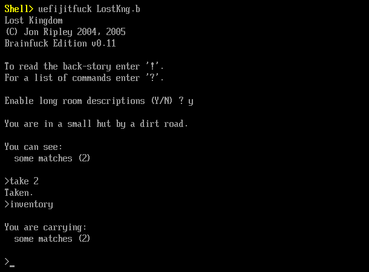

uefi-jitfuck
============

A JIT (Just-In-Time) compiler for Brainfuck programming language running solely
on x86_64 UEFI (Universal Extensible Firmware Interface).



[The Lost Kingdom](http://jonripley.com/i-fiction/games/LostKingdomBF.html) by
Jon Ripley - over 2-megabyte adventure text game running inside UEFI Shell
with *uefi-jitfuck*.

## Building

### Requirements

* C Compiler, e.g. GCC as well as linker (ld)
* GNU Make
* [GNU-EFI](https://sourceforge.net/projects/gnu-efi/)

### Compiling

Just execute:

```
$ make
```

in the project root directory. This will create `bin/` directory with
`uefijitfuck.efi` executable inside - this is the binary you want to run.

## Usage

First, build the project or grab the executable from the
[Releases](https://github.com/m4tx/uefi-jitfuck/releases) page and put it on
your ESP (EFI System Partition) along with the programs you want to run. Then,
there are several options:

* Use your motherboard's built-in boot entry editor
* Add a boot entry using `efibootmgr`
* Use a UEFI Shell

If you don't want to run this on your UEFI directly, you can also use OVMF 
(UEFI firmware for QEMU/KVM).

The application requires one argument: the name of the file containing
the Brainfuck program you want to run.
